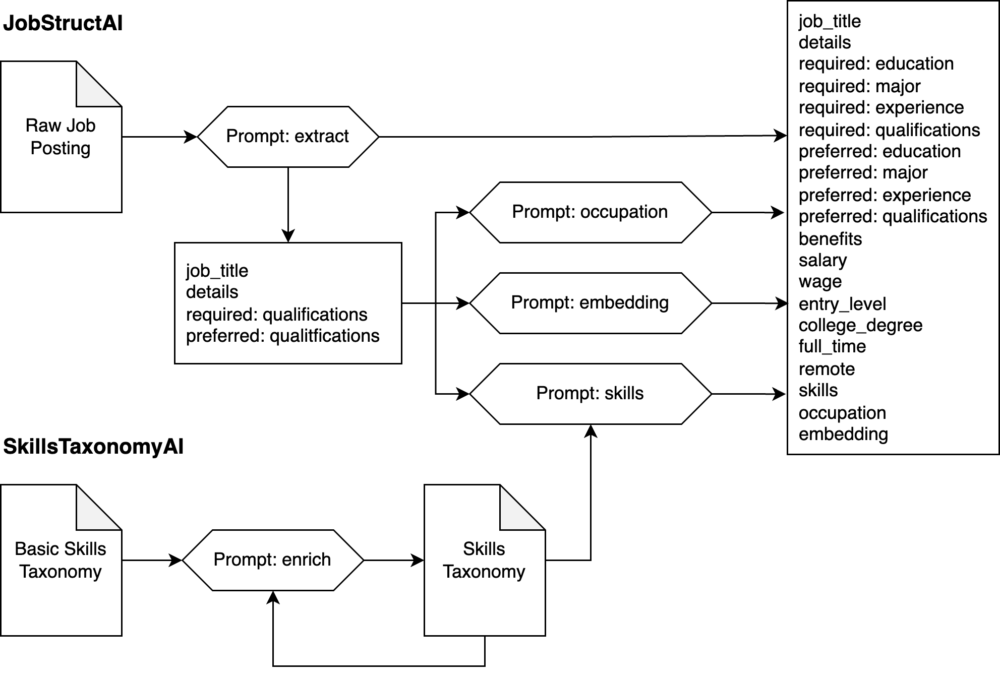

# job-posting-structure

This repository provides the `jobstruct` python package, which implements methods for extracting structured informaton from job postings as described in:

Mark Howison, William O. Ensor, Suraj Maharjan, Rahil Parikh, Srinivasan H. Sengamedu, Paul Daniels, Amber Gaither, Carrie Yeats, Chandan K. Reddy, Justine S. Hastings. 2024. Extracting Structured Labor Market Information from Job Postings with Generative AI. *Digital Government: Research and Practice*, in press. doi:[10.1145/3674847](https://dl.acm.org/doi/10.1145/3674847)

> **Abstract**: Labor market information is an important input to labor, workforce, education, and macroeconomic policy. However, granular and real-time data on labor market trends are lacking; publicly available data from survey samples are released with significant lags and miss critical information such as skills and benefits. We use generative Artificial Intelligence to automatically extract structured labor market information from unstructured online job postings for the entire U.S. labor market. To demonstrate our methodology, we construct a sample of 6,800 job postings stratified by 68 major occupational groups, extract structured information on educational requirements, remote-work flexibility, full-time availability, and benefits, and show how these job characteristics vary across occupations. As a validation, we compare frequencies of educational requirements by occupation from our sample to survey data and find no statistically significant difference. Finally, we discuss the scalability to collections of millions of job postings. Our results establish the feasibility of measuring labor market trends at scale from online job postings thanks to advances in generative AI techniques. Improved access to such insights at scale and in real-time could transform the ability of policy leaders, including federal and state agencies and education providers, to make data-informed decisions that better support the American workforce.

Copyright Amazon.com, Inc. or its affiliates. All Rights Reserved.

Copyright National Association of State Workforce Agencies. All Rights Reserved.

Licensed under Creative Commons Attribution-NonCommercial-ShareAlike 4.0 International.

## Overview

Job postings are challenging to use as a data source for labor market information because of the variation in how they are written. Generative AI models excel at summarizing the kind of variation in language, formatting, and conventions found in job postings. This package provides Generative AI methods for extracting structured information from job postings, which we studied in the paper cited above. Using an example job posting for a software engineer, you can view an example of the [original job description](tests/jobstruct/SDE_II.txt) and the resulting [structured information](tests/jobstruct/SDE_II_JobStructAI.json) extracted by the package.

## Organization

The package is organized into three main classes:
- **SkillsTaxonomyAI** provides a GenAI method for enriching an existing skills taxonomy, which defaults to a basic taxonomy derived from the [O*NET® Database](https://www.onetcenter.org/database.html). It requires a subscription to the [Amazon Bedrock](https://aws.amazon.com/bedrock) service for access to GenAI foundation models (Claude 3 Haiku by default).
- **JobStructAI** provides GenAI methods for extracting structured information from job description text, optionally using a SkillsTaxonomy object to identify skills. It also requires a Bedrock subscription.
- **JobStructHTML** provides a basic, deterministic method for extracting information from an HTML-formatted job posting using HTML tags and conventions for typical section names. It requires no subscriptions and can be run offline.

It also provides a command-line interface to the SkillsTaxonomyAI and JobStructAI classes.

## Prompt Architecture

The SkillsTaxonomyAI class uses a single prompt `enrich`, which can be called iteratively to expand the child nodes of the skills taxonomy, starting from a basic taxonomy.

The JobStructAI class uses the `extract` prompt for an initial extraction of structured information from the job posting. It concatenates the `job_title`, `details`, `required:qualifications`, and `preferred:qualifications` fields into a cleaned job description, which can be optionally run through the `occupation`, `embedding`, and `skills` prompts to add those corresponding fields. The `skills` prompt additionally requires a SkillsTaxonomyAI object as input.

## API Examples

### SkillsTaxonomyAI class

The SkillsTaxonomyAI class can be initialized without any parameters, which will load a basic skills taxonomy included in the package.

    from jobstruct import SkillsTaxonomyAI
    skills = SkillsTaxonomyAI()

You can also start from a custom skills taxonomy in JSON format (see `src/jobstruct/data/onet_taxonomy.json` for an example):

    skills = SkillsTaxonomyAI("mySkillsTaxonomy.json")

Once initialized, the skills taxonomy can be enriched using generative AI queries against a Bedrock client with:

    import boto3
    client = boto3.client("bedrock-runtime")
    skills.enrich(client)

### JobStructAI class

Initialize a JobStructAI object from a text filename, a text string, an HTML filename, or an HTML string, along with a Bedrock client and (optionally) a skills taxonomy:

    from jobstruct import JobStructAI

    with open("myJobPosting.txt") as f:
        text = f.read()
    j = JobStructAI(text, client, skills)

    j = JobStructAI.from_file("myJobPosting.txt", client, skills)

    with open("myJobPosting.html") as f:
        html = f.read()
    j = JobStructAI.from_html(html, client, skills)

    j = JobStructAI.from_html_file("myJobPosting.html", client, skills)

The extracted information can be accessed as object attributes or can be exported to a dictionary with:

    j.to_dict()

The schema is:

    job_title: str
    details: List[str]
    required:
        education: str
        major: List[str]
        experience: int
        qualifications: List[str]
    preferred:
        education: str
        major: List[str]
        experience: int
        qualifications: List[str]
    benefits: List[str]
    salary: List[float]
    wage: List[float]
    entry_level: bool
    college_degree: bool
    full_time: bool
    remote: bool
    skills: List[str]
    occupation: List[str]
    embedding: List[float]

### JobStructHTML class

Initialize a JobStructHTML object from a filename, an HTML string, or an existing BeautifulSoup object that contains parsed HTML:

    from jobstruct import JobStructHTML

    j = JobStructHTML.from_file("myJobPosting.html")

    with open("myJobPosting.html") as f:
        html = f.read()
    j = JobStructHTML.from_string(html)

    soup = BeautifulSoup(html, "html.parser")
    j = JobStructHTML.from_soup(soup)

The object contains attributes for each segment parsed from the job posting:

- description
- benefits
- qualitifications
- responsibilities
- requirements
- eeo (Equal Employment Opportunity)
- other

## Command-line examples

The `jobstruct` command provides access to the SkillsTaxonomyAI and JobStructAI classes through the subcommands:

    jobstruct enrich -h
    jobstruct extract -h

Create an enriched skills taxonomy from the included basic taxonomy with:

    jobstruct enrich -o mySkillsTaxonomy.json

Extract structured information from a text or HTML job posting file with:

    jobstruct extract --skills mySkillsTaxonomy.json -o myJobPosting.json myJobPosting.txt
    jobstruct extract --skills mySkillsTaxonomy.json -o myJobPosting.json myJobPosting.html

# Authors

- Mark Howison
- William O. Ensor
- Suraj Maharjan
- Rahil Parikh
- Srinivasan H. Sengamedu
- Paul Daniels
- Amber Gaither
- Carrie Yeats
- Chandan K. Reddy
- Justine S. Hastings
- Nikhil Abhyankar

# Citations and Credits

Includes information from [O*NET OnLine Help: The Database](https://www.onetonline.org/help/onet/database) by the U.S. Department of Labor, Employment and Training Administration (USDOL/ETA).  Used under the [CC BY 4.0](https://creativecommons.org/licenses/by/4.0/) license.
